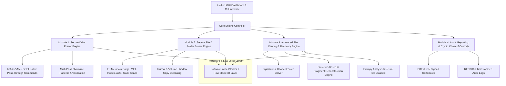
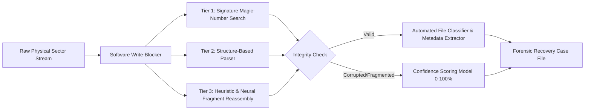
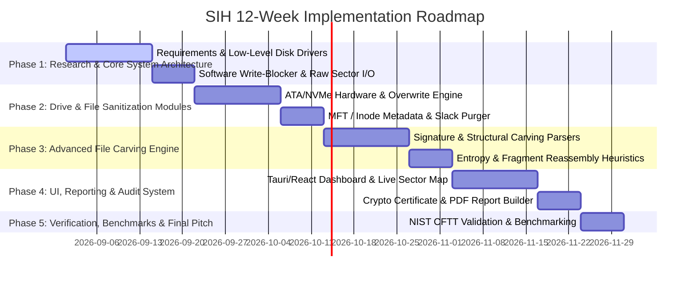

# Statement of Work (SOW) & Technical Specification
## Project Title: Integrated Secure Data Erasure and Advanced File Recovery Tool for Digital Forensics & Data Sanitization
**Target Platform:** Cross-Platform (Windows, Linux, macOS)  
**SIH Problem Statement Focus:** Cyber Security & Digital Forensics  
**Document Version:** 1.0.0  
**Date:** September 2026  

---

## 1. Executive Summary & Project Background

### 1.1 Context & Problem Statement
Modern digital storage technologies—ranging from high-speed NVMe/SATA SSDs and traditional HDDs to USB drives and SD cards—present two diametrically opposed challenges in digital forensics and cybersecurity:
1. **Secure Data Sanitization:** Organizations and government agencies must guarantee that decommissioned drives or discarded files are purged permanently to prevent unauthorized data leaks. Traditional file deletion leaves data intact in storage blocks and file system metadata (e.g., MFT, Inodes, Journal logs).
2. **Forensic Evidence Recovery:** Law enforcement agencies and incident response teams require forensic-grade tools to carve and reconstruct deleted files from formatted, damaged, or encrypted media without relying on intact file system metadata.

Currently, forensic experts and security analysts are forced to switch between disparate tools (e.g., dban, blancco, photorec, autopsy, FTK), leading to high operational friction, fragmented audit trails, lack of unified verification, and high licensing costs.

### 1.2 Objective
To design, develop, and deliver a unified, enterprise-grade, cross-platform software application that seamlessly integrates **Hardware/Logical Data Sanitization**, **Selective Metadata & Slack Space Erasure**, and **Advanced Heuristic/Signature-Based File Carving & Recovery**, supported by a cryptographically verifiable **Chain-of-Custody Audit & Reporting Engine**.

---

## 2. Comprehensive Scope of Work (SOW)

The proposed platform consists of **Five Interconnected Core Modules**:



---

### Module 1: Secure Drive Eraser Engine (Hardware & Logical Sanitization)

#### 1.1 Drive Protocols & Device Support
* **Device Types:** NVMe SSDs, SATA HDDs/SSDs, SAS Enterprise Drives, USB Mass Storage (Flash drives, external HDDs), SD/microSD cards, eMMC.
* **Low-Level Native Commands:**
  * **NVMe:** `Format NVM` (User Data Erase, Crypto Erase) and `Sanitize` command set (`Block Erase`, `Overwrite`, `Crypto Erase`).
  * **SATA / ATA:** `ATA Secure Erase` (SECURITY ERASE UNIT), `Enhanced Secure Erase`, `TRIM` / `DEALLOCATE` sector commands.
  * **SCSI / SAS:** `SANITIZE` (Overwrite, Block Erase, Crypto Erase) and `FORMAT UNIT`.
* **Logical Overwrite Patterns (Fall-back & Multi-Pass):**
  * **IEEE 2883-2022:** Clear, Purge, Destroy parameters.
  * **NIST SP 800-88 Rev. 2 (2025):** Purge & Clear baseline configurations.
  * **DoD 5220.22-M:** 3-Pass (`0x00`, `0xFF`, Pseudo-Random) & 7-Pass ECE.
  * **Gutmann Method:** 35-pass algorithm for magnetic media legacy support.
  * **Custom Algorithms:** User-definable pass patterns and cryptographically secure random sequences (CSPRNG via ChaCha20/AES-CTR).

#### 1.2 Verification & Anti-Wear Leveling Safeguards
* **Verification Methods:**
  * **Full Sector Verification:** 100% block read back after erasure.
  * **Sampled Sector Verification:** Statistical sampling (e.g., 5%, 10%, 20% random sector checks with confidence interval calculation).
  * **Cryptographic Hash Verification:** Pre-erasure vs. post-erasure block hashing (calculating SHA-256 to ensure post-erase values match `0x00` or expected pseudo-random state).
* **Hidden Area Sanitization:**
  * Automatic detection and wipe of **HPA** (Host Protected Area), **DCO** (Device Configuration Overlay), and **G-List / Reallocated Sectors** where accessible via vendor commands.

---

### Module 2: Secure File & Folder Eraser Engine (Selective Metadata & Slack Cleansing)

#### 2.1 File System Deep Sanitization
* **File Systems Supported:** NTFS, FAT16/FAT32, exFAT, ext2/ext3/ext4, APFS, Btrfs.
* **Targeted Erasure Features:**
  * **File Data Overwrite:** Multi-pass sector overwriting matched to exact cluster allocation size.
  * **Metadata Sanitization:**
    * *NTFS:* Clearing `$MFT` record, `$LOGFILE`, `$UsnJrnl`, `$Attribute_Definition`, and Alternate Data Streams (ADS).
    * *ext4:* Zeroing inode struct, clearing extents, flushing jbd2 journal entries.
    * *FAT/exFAT:* Wiping directory entries, long file name (LFN) blocks, and FAT allocation tables.
  * **Slack Space Cleansing:** Wiping RAM slack and Sector slack (unused bytes between end of file content and end of allocated sector/cluster).
  * **System Traces & History:** Wiping Windows Volume Shadow Copies (VSS), Shellbags, Jump Lists, LNK files, Prefetch records, and macOS Spotlight index traces.

---

### Module 3: Advanced File Carving & Recovery Engine (Forensic Recovery)

#### 3.1 Write-Blocker & Evidential Preservation Layer
* **Software Write-Blocker:** Direct physical disk access (`\\\\.\\PhysicalDriveX` on Windows, `/dev/sdX` / `/dev/nvmeX` on Linux) mounted in strict Read-Only (`O_RDONLY` / `GENERIC_READ`) mode with kernel read locks to prevent OS metadata mutation.
* **Integrity Hashing:** Continuous stream MD5 / SHA-256 disk image hashing before and after carving sessions.

#### 3.2 Multi-Tiered Carving Techniques



* **Tier 1: Signature-Based Carving (Header/Footer Matching):**
  * Support for 150+ standard file types (JPEG, PNG, GIF, PDF, DOCX/XLSX/PPTX, ZIP, RAR, MP4, AVI, MKV, SQLite, ELF, PE, Executables).
  * Fast pattern matching using Aho-Corasick & SIMD-accelerated string scanning.
* **Tier 2: Structure-Based Carving:**
  * Deep validation of file internal headers, chunk sizes, length fields, stream offsets (e.g., parsing PNG `IHDR` to `IEND`, ZIP Central Directory, PDF Cross-Reference tables `%PDF-` to `%%EOF`).
* **Tier 3: Fragment Reconstruction & Intelligent Heuristics:**
  * **Entropy & Chi-Square Analysis:** Distinguishing high-entropy encrypted/compressed data blocks from low-entropy text/executable blocks.
  * **Bilinear / Fragment Stitching:** Reconstructing fragmented files (split across non-contiguous clusters) by analyzing bi-gram transition probabilities and content continuity.
  * **Neural / ML File Classifier:** Pre-trained model to identify orphan blocks without headers/footers (assigning likelihood probabilities to file types).
* **Confidence Scoring Model (0 - 100%):**
  * Evaluates header validity, payload structural integrity, checksum validation (e.g., CRC32, PNG chunk CRCs), and file rendering feasibility.

---

### Module 4: Audit, Reporting & Forensic Chain of Custody System

#### 4.1 Tamper-Resistant Report Generation
* **Formats:** PDF/A (Archival standard), Cryptographically Signed JSON, and XML.
* **Audit Trail Metadata:**
  * Operator ID, Organization, Case Reference Number.
  * Target Device Details: Model, Serial Number, Firmware Version, Capacity, Bus Type, Sector Size (512e/4Kn).
  * Erasure/Recovery Parameters: Algorithm selected, passes executed, verification method, execution start/end timestamps.
  * Bad Sector Log & Write Error Manifest.
* **Cryptographic Signing & Chain of Custody:**
  * Digital signature generation using standard X.509 certificates (RSA-4096 or ECDSA P-384).
  * RFC 3161 Compliant Trusted Time-Stamping.
  * Hash chain validation (Merkle Tree representation of all raw sector operations).

---

### Module 5: Graphical User Interface Dashboard (UX / UI Design)

* **Architecture:** Tauri / Electron frontend powered by React, Tailwind-styled custom components, and high-performance C++/Rust native bindings.
* **Key UI Screens & Views:**
  1. **Dashboard Home:** System drive status, temperature, SMART attributes, quick action launchers.
  2. **Drive Sanitization Studio:** Interactive sector map visualization (grid showing wiping progress, block states: Pending, Erasure, Verification, Error), algorithm picker, wipe scheduler.
  3. **File/Folder Sanitizer:** Multi-select drag-and-drop tree view with slack space and metadata purge checkboxes.
  4. **Forensic Recovery Studio:** Real-time carving stream viewer, file preview panel (images, text, hex, media player), confidence score indicators, classification filter tabs.
  5. **Hex & Disk Structure Viewer:** Low-level sector reader, offset inspection, byte search, raw structure parsing.
  6. **Audit & Certificate Vault:** Verification certificate builder, PDF viewer, digital signature verifier.

---

## 3. Technology Stack & System Architecture

| Component Layer | Technology Selected | Rationale & Advantage |
| :--- | :--- | :--- |
| **Core Native Engine** | **Rust** (with C/C++ FFI for OS APIs) | Memory safety, zero-cost abstractions, maximum I/O performance, native cross-platform disk control without GC pauses. |
| **GUI Framework** | **Tauri v2** + **React 18** / **TypeScript** | Ultra-lightweight binary size (~15MB vs ~120MB Electron), low RAM consumption (~40MB), maximum security boundary. |
| **Low-Level Disk I/O** | `Win32 DeviceIoControl` (Windows) / `libudev`, `ioctl`, `sg3_utils` (Linux) | Native ATA/NVMe pass-through, raw block read/write bypassing OS filesystem caches. |
| **Styling & Visuals** | Vanilla CSS + CSS Modules + Canvas API | Dark mode forensic aesthetic, ultra-smooth 60fps rendering for sector block maps and carving streams. |
| **File Parsing & Carving** | Custom Rust zero-copy binary parser + SIMD string matching | Multi-threaded sector scanning utilizing all available CPU cores. |
| **Cryptographic Engine** | OpenSSL / Ring (Rust) | FIPS 140-3 compliant cryptographic operations, RSA/ECDSA signing, RFC 3161 timestamps. |
| **Reporting Engine** | typst / print-pdf (Rust) | High-speed, tamper-proof vector PDF document generation. |

---

## 4. International Standards Compliance Matrix

| Standard Code | Name / Organization | Scope in Software Implementation |
| :--- | :--- | :--- |
| **IEEE 2883-2022** | Standard for Sanitizing Storage Methods | Native NVMe Sanitize, Format NVM, ATA Secure Erase, SCSI Sanitization verification. |
| **NIST SP 800-88 Rev. 2** | Guidelines for Media Sanitization (2025) | Execution workflows for Clear, Purge, and Destroy sanitization policies. |
| **DoD 5220.22-M** | US Department of Defense Standard | Implementation of 3-pass and 7-pass structured data overwriting. |
| **ISO/IEC 27040:2015** | Information technology — Security techniques — Storage security | Data sanitization and verification compliance standards for enterprise storage. |
| **ISO/IEC 27037:2012** | Digital evidence handling & chain of custody | Preservation, identification, collection, and acquisition of digital evidence. |
| **RFC 3161** | Internet X.509 Public Key Infrastructure Time-Stamp Protocol | Trusted cryptographic timestamping on erasure certificates and recovery logs. |
| **NIST CFTT** | Computer Forensic Tool Testing Program | Test specifications for disk imaging and file carving accuracy. |

---

## 5. Mathematical & Algorithmic Formulation

### 5.1 Entropy Calculation (Shannon Entropy)
To detect encrypted/compressed files or erased sectors:
$$H(X) = - \sum_{i=0}^{255} P(x_i) \log_2 P(x_i)$$
Where $P(x_i)$ is the frequency of byte value $i$ in a 512-byte sector block.
* $H(X) \approx 8.0$: High randomness (Encrypted, compressed, or CSPRNG random overwrite).
* $H(X) \approx 0.0$: Uniform block (Zero-filled purged sector).

### 5.2 Confidence Scoring Index ($S_{\text{file}}$)
For each carved file, confidence score $S_{\text{file}} \in [0, 100]$ is computed as:
$$S_{\text{file}} = w_1 \cdot C_{\text{header}} + w_2 \cdot C_{\text{footer}} + w_3 \cdot C_{\text{struct}} + w_4 \cdot (100 - |H_{\text{expected}} - H_{\text{actual}}| \times 12.5)$$
Where:
* $C_{\text{header}}, C_{\text{footer}} \in \{0, 100\}$ (Presence and offset accuracy of valid magic numbers).
* $C_{\text{struct}} \in [0, 100]$ (Validity of internal streams, headers, or chunk CRCs).
* $w_1, w_2, w_3, w_4$ are weights derived empirically ($\sum w_i = 1.0$).

---

## 6. Work Breakdown Structure (WBS) & Deliverables

```
1. Core Platform Architecture & Native Core Engine
   1.1 System Interface & OS Raw Disk Pass-through Layer
   1.2 Memory & Disk Thread Pool Manager
2. Secure Drive Eraser Module
   2.1 ATA/NVMe/SCSI Command Set Driver
   2.2 Overwrite Pattern Engine (NIST, IEEE, DoD, Gutmann)
   2.3 Multi-Level Verification & Hashing Engine
3. Secure File & Folder Eraser Module
   3.1 File System Traversal & Cluster Allocation Parser
   3.2 Metadata & Journal Purge (MFT, Inodes, ADS, Shadow Copy)
   3.3 Slack Space & Residual Wiping Engine
4. Advanced File Carving & Recovery Module
   4.1 Read-Only Software Write-Blocker Engine
   4.2 Signature & Structural File Parser Library
   4.3 Fragment Reassembly & Entropy Classifier
   4.4 File Integrity & Confidence Scoring System
5. Audit & Compliance Engine
   5.1 Merkle-Tree Hash Chain Logging
   5.2 Digital Signature & PDF Certificate Builder
6. User Interface & Graphical Dashboard
   6.1 Interactive Drive & Sector Map Renderer
   6.2 Live Carving Inspection & Hex Editor Component
   6.3 Verification Vault & Task Manager
7. Quality Assurance, Forensic Benchmarking & Compliance Documentation
   7.1 NIST CFTT Test Suite Execution
   7.2 User Manual, Technical Specification & Developer API Docs
```

---

## 7. 12-Week Execution Roadmap (SIH Development Plan)



---

## 8. Expected Impact & Key Differentiators

1. **Dual-Capability Forensic Ecosystem:** Eliminates the need to buy and deploy separate commercial tools for sanitization and recovery.
2. **True IEEE 2883-2022 & NIST 800-88 R2 Compliance:** Leverages modern NVMe Sanitize/Format NVM hardware primitives instead of ineffective software overwrites on SSD flash controllers.
3. **Forensic Evidence Preservation:** Guarantees zero write pollution during recovery via integrated OS-level write-blocking drivers.
4. **Intelligent Fragment Carving:** Recovers damaged or non-contiguous files that standard file carving tools (e.g. PhotoRec) fail to reconstruct.
5. **Tamper-Evident Chain of Custody:** Cryptographically signed certificates guarantee that drive erasure reports withstand courtroom legal scrutiny and strict compliance audits.

---
*End of Statement of Work Document.*
